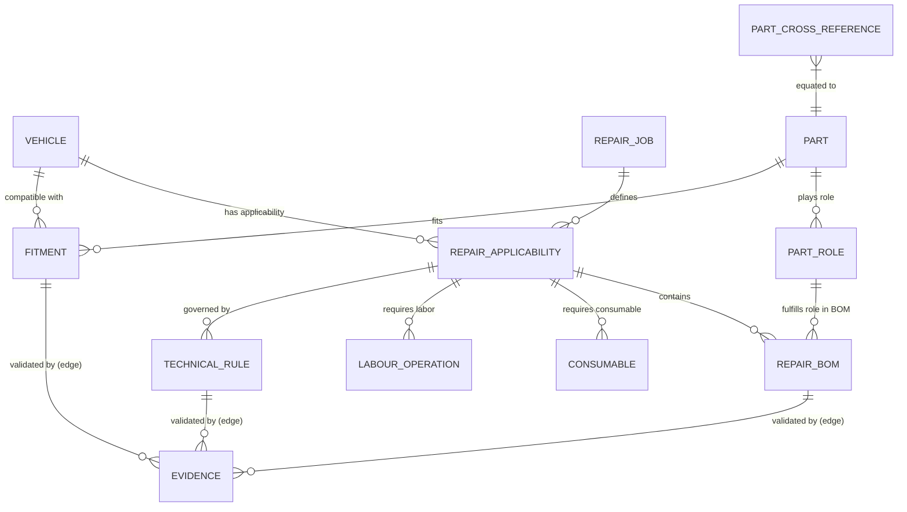

# 04. REPAIR KNOWLEDGE MODEL — BibendIA Data Architecture

This document defines the formal data architecture and entity-relationship model for **BibendIA Repair Knowledge Graph**.

---

## 1. Architectural Principles

1. **Separation of Fitment vs. Repair Knowledge**:
   - **Fitment**: "Part $X$ fits Vehicle $Y$."
   - **Repair Knowledge**: "For Intervention $Z$ on Vehicle $Y$, components $A, B$ are REQUIRED, $C$ is RECOMMENDED, consumable $D$ is CONDITIONAL, and bolt $E$ is REPLACE_ONCE."
2. **Edge-Level Provenance & Evidence**:
   - Evidence is not just attached to nodes (entities), but directly to relationship edges (`REPAIR_BOM`, `TECHNICAL_RULE`, `FITMENT`).
3. **Strict Confidence States**:
   - `VERIFIED_OEM` $\rightarrow$ Fully verified by OEM service manuals / RMI.
   - `VERIFIED_MANUFACTURER` $\rightarrow$ Explicitly documented by Tier-1 manufacturer (Gates, SKF, Continental, etc.).
   - `MULTI_SOURCE_VERIFIED` $\rightarrow$ Confirmed by $\ge 2$ independent reliable technical sources.
   - `DERIVED_FROM_KIT` $\rightarrow$ Extracted from commercial repair kit contents.
   - `COMMUNITY_SUPPORTED` $\rightarrow$ Crowdsourced or open community dataset.
   - `INFERRED` $\rightarrow$ Logical rule inference (requires manual workshop validation before quote inclusion).
   - `UNKNOWN` $\rightarrow$ Unconfirmed.

---

## 2. Data Schema & Entity Specifications



---

## 3. Entity Data Dictionaries

### Entity: VEHICLE
```json
{
  "vehicle_id": "VAG_GOLF7_16TDI_CLHA",
  "make": "Volkswagen",
  "model": "Golf VII",
  "generation": "5G1/BQ1",
  "production_from": "2012-08",
  "production_to": "2017-03",
  "engine_code": "CLHA",
  "engine_family": "EA288",
  "displacement_cc": 1598,
  "power_kw": 77,
  "power_hp": 105,
  "fuel_type": "DIESEL",
  "transmission_code": "MWW",
  "drivetrain": "FWD",
  "kba_numbers": ["0603-BKZ"]
}
```

### Entity: REPAIR_JOB
```json
{
  "job_id": "JOB_TIMING_BELT_REPLACEMENT",
  "system": "DISTRIBUCION",
  "subsystem": "CORREA_DISTRIBUCION",
  "name": "Sustitución de Kit de Distribución y Bomba de Agua",
  "description": "Sustitución completa del sistema de distribución por correa, incluyendo tensores, rodillos, bomba de agua accionado y tornillería de un solo uso."
}
```

### Entity / Edge: REPAIR_BOM (Per-Edge Relationship with Provenance)
```json
{
  "bom_id": "BOM_GOLF7_CLHA_TIMING_001",
  "applicability_id": "APP_GOLF7_CLHA_TIMING",
  "part_role": "water_pump",
  "quantity": 1,
  "requirement_type": "RECOMMENDED",
  "bom_classification": "DERIVED_FROM_KIT",
  "condition": "Driven by timing belt; replace synchronously to avoid dual labor cost.",
  "side": "FRONT",
  "replace_once": false,
  "evidence": {
    "source": "Continental PIC & Gates TechZone",
    "evidence_type": "TIER1_KIT_BOM",
    "evidence_url": "https://www.continental-engineparts.com/pic/CT1167WP1",
    "confidence_state": "MULTI_SOURCE_VERIFIED",
    "checked_at": "2026-09-29",
    "reuse_status": "COMMERCIAL_REUSE_RESTRICTED_RETAIN_PROVENANCE_LINK"
  }
}
```

### Entity: PART_ROLE
- `timing_belt`: Correa dentada de distribución.
- `tensioner_pulley`: Rodillo tensor de distribución.
- `idler_pulley`: Rodillo guía/inversor.
- `water_pump`: Bomba de agua refrigerante.
- `stretch_bolt_crankshaft`: Tornillo central de cigüeñal (un solo uso).
- `stretch_bolt_engine_mount`: Tornillos del soporte de motor (un solo uso).
- `brake_pad_front`: Juego de pastillas de freno delanteras.
- `brake_disc_front`: Pareja de discos de freno delanteros.
- `wear_sensor`: Sensor de desgaste de pastillas.
- `clutch_disc`: Disco de embrague.
- `pressure_plate`: Maza de presión de embrague.
- `release_bearing_csc`: Cojinete hidráulico de empuje / CSC.
- `dual_mass_flywheel`: Volante bimasa.

### Entity / Edge: TECHNICAL_RULE
```json
{
  "rule_id": "RULE_CLHA_CRANKSHAFT_BOLT_REPLACE_ONCE",
  "applicability_id": "APP_GOLF7_CLHA_TIMING",
  "rule_type": "SINGLE_USE_HARDWARE",
  "condition": "IF engine_mount_or_crankshaft_pulley_disassembled",
  "action": "REQUIRE stretch_bolt_engine_mount AND stretch_bolt_crankshaft",
  "rationale": "Torque-to-yield bolts experience permanent elastic deformation upon installation.",
  "evidence": {
    "source": "VAG ERWIN RMI & Elring Technical Guide",
    "confidence_state": "VERIFIED_OEM",
    "evidence_url": "https://www.elring.com/tech-data",
    "reuse_status": "ALLOW_FACT_DERIVATION"
  }
}
```
