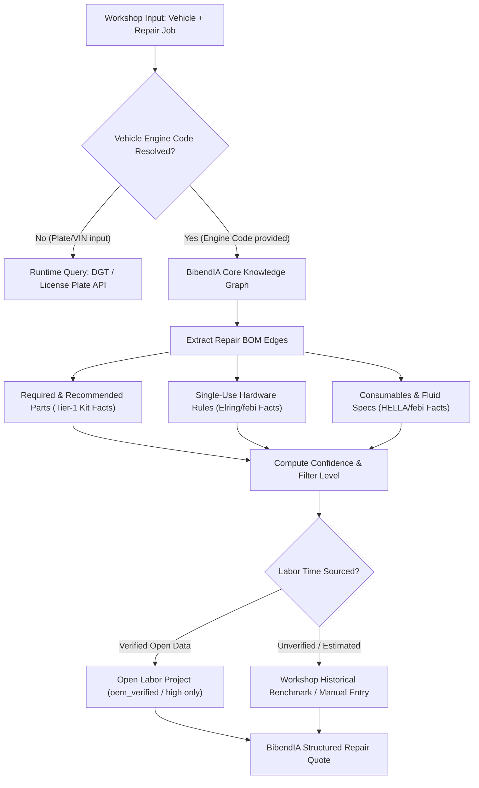

# 10. RECOMMENDATION — Strategic Roadmap for BibendIA Core

This document outlines the strategic recommendations for building the **BibendIA Repair Knowledge Core**.

---

## 1. Executive Summary & Decision Framework

> **Can we build a system using free/open sources that, given a specific vehicle and intervention, reliably produces the required components, recommended parts, consumables, and technical rules?**
>
> **ANSWER: CONDITIONAL_GO.**
>
> - **YES** for Repair BOMs, Consumables, and Single-Use Hardware Rules derived legally from Tier-1 manufacturer kits and technical bulletins.
> - **CONDITIONAL** on filtering open labor data (e.g. Open Labor Project AI estimates) and respecting legal boundaries (no bulk database replication, maintaining edge-level provenance, setting legal uncertainty to `reuse_status = UNKNOWN`).
> - **COMMERCIAL API REQUIRED** for Spanish License Plate $\rightarrow$ Engine Code resolution (DGT API) and European OEM Labor Times (TecRMI) if high-precision labor quotes are needed.

---

## 2. Technical Data & Ingestion Architecture

---

## 3. Data Strategy Rules

1. **BibendIA Derives Facts; Does Not Replicate Databases**:
   - BibendIA stores derived technical relationships with full provenance (`source`, `evidence_url`, `confidence`, `reuse_status`).
   - BibendIA does not perform systematic bulk extraction to clone third-party databases.
2. **Open Labor Project AI Filtering**:
   - Only records with `confidence: oem_verified` or `high` are admissible. `estimated` or `inferred` entries cannot feed quotes automatically.
3. **Manufacturer Kit Deconstruction**:
   - Component lists extracted from kits (e.g. SKF VKMC, LuK RepSet DMF) remain categorized as `DERIVED_FROM_KIT`. They are not elevated to `EXPLICIT_BOM` unless supported by explicit technical bulletins or OEM service rules.
4. **NHTSA vPIC Scope**:
   - Used strictly for US-market shared global platform VIN decoding and recall normalization. European fleet identification relies on European CoC / Type Approval data (data.europa.eu) and DGT lookups.

---

## 4. Final Recommendation Decision

**RECOMMENDATION: CONDITIONAL_GO**

Proceed with building the BibendIA Technical Repair Knowledge Base using the architecture, confidence engine, and edge-level provenance rules validated in this discovery.
